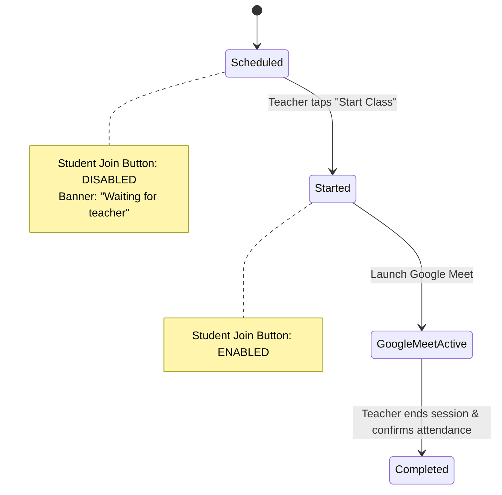

# Shalaverse — Product Requirements Document (PRD)

> **Functional Specification for Class Scheduling, Online Learning, Attendance, and Parent Engagement**

---

## 1. Proposal & Executive Overview

**Shalaverse** is a cross-platform digital management application designed for educational institutions, including schools, coaching centres, tuition centres, and training academies. 

The platform brings **Administrators**, **Teachers**, **Students**, and **Parents** into a single structured ecosystem to streamline class scheduling, online session delivery via Google Meet, automated attendance tracking, delay notifications, and contextual communication.

### Core Objectives
* **Simplify Administration**: Centralized onboarding and management of administrators, teachers, students, and parents.
* **Unified Class Operations**: Create subjects, assign teachers/students, and schedule classes from one place.
* **Seamless Virtual Learning**: Integrated Google Meet online sessions with role-restricted access.
* **Automated Punctuality & Tracking**: Timely 15-minute reminders and 5-minute non-start delay alerts.
* **Parent Visibility**: Real-time access for parents to view children's schedules, teacher details, and verified attendance.
* **Structured Query Resolution**: Dedicated remark channels for class-specific feedback and general institution queries.

---

## 2. Role-Based Access Control (RBAC) & User Matrix

The system enforces strict role-based capability boundaries:

| Role | Core Capabilities |
| :--- | :--- |
| **Administrator** | Manage user accounts (teachers, students, parents); create subjects & class schedules; assign teachers and students; view attendance & delay reports; review parent remarks and general queries. |
| **Teacher** | View assigned schedules and student rosters; initiate & join online class sessions; confirm post-class student attendance (`Present`, `Absent`, `Late`, `Excused`). |
| **Student** | View upcoming class schedule & subject details; join Google Meet session **only after the teacher starts the class**; view personal attendance history. |
| **Parent** | View linked children’s schedules, assigned teachers, and verified attendance; submit class-related remarks and general queries. **Strictly restricted from joining online classes.** |

---

## 3. User Onboarding & Account Management

### 3.1 Invitation & Verification Flow
* **Email Invitations**: Administrators send email invitations to teachers, students, and parents.
* **Account Activation**: Invited users verify their email address, establish credentials, and join with their assigned role.
* **Unified Identity**: Existing users invited to additional roles sign in with their existing account without creating a duplicate login or password.
* **Multi-Role Support**: A single user may hold multiple responsibilities (e.g., an Administrator who also teaches specific subjects).

### 3.2 Student & Parent Profile Management
* **Student Profile Fields**: Student Name, Admission Number, Class / Batch, Assigned Subjects, and Status (`Active`, `Inactive`).
* **Multi-Parent Association**: One or more parent accounts can be linked to a single student profile.
* **Young Students (No Independent Login)**: Students without a mobile number or email address do not require an independent account. All schedules and attendance remain accessible via the linked parent account.
* **Older Students**: Invited to create independent logins for direct class participation.
* **Account Deletion Semantics**:
  * Parents can request account deletion via application settings.
  * Deleting a parent account removes the parent's login access and child linkage, but **preserves student academic, schedule, and attendance records**.

---

## 4. Subjects, Classes & Scheduling Engine

### 4.1 Subject & Class Configuration
* **Subjects**: Administrators configure course subjects (e.g., Mathematics, History, Science, English, or custom courses).
* **Schedule Attributes**: Subject, Assigned Teacher, Batch or Student List, Date, Start Time, and Duration.
* **Google Meet Association**: Every online class schedule automatically links to a designated Google Meet session.

### 4.2 Class Reminder Notifications
* **Timing**: Triggered exactly **15 minutes before** the scheduled start time.
* **Teacher**: Receives assigned subject and start time reminder.
* **Student**: Receives upcoming class notification.
* **Parent**: Receives alert that the child's class is about to begin.

---

## 5. Online Class Execution & State Machine

### 5.1 Class Lifecycle States
1. `SCHEDULED`: Class is created and visible on schedules.
2. `STARTED`: Teacher has initiated the session; Google Meet link is active for students.
3. `COMPLETED`: Class session finished; awaiting teacher attendance confirmation.
4. `MISSED`: Class was not started within the grace period and flagged by Admin.
5. `CANCELLED`: Class officially closed or rescheduled by Admin.

### 5.2 Teacher & Student Journeys

#### Teacher Journey
1. Open scheduled class card.
2. Review subject, time, and assigned student roster.
3. Tap **Start Class** / **Join Class**.
4. System updates class status to `STARTED` and opens Google Meet session.
5. Student **Join** buttons become active globally.

#### Student Journey
1. Open scheduled class card.
2. Prior to teacher start: **Join button remains disabled**, displaying a *"Waiting for teacher to start"* state.
3. Once teacher starts class: **Join button activates**.
4. Tap **Join** to open Google Meet session.

#### Parent Restriction
* Parents can view schedules and teacher details but **cannot access or join Google Meet sessions**.

---

## 6. Delay Alerts & Missed Class Handling

* **5-Minute Non-Start Rule**: If a scheduled class is not started by the teacher within **5 minutes** after the start time:
  1. Teacher receives an urgent start reminder.
  2. Administrator receives an alert notifying them of the delayed start.
* **No Auto-Cancellation**: The system does **not** automatically cancel the class.
* **Admin Resolution Options**: The Administrator reviews delayed classes and decides whether to:
  * Keep the class open (awaiting late start)
  * Close / Cancel the class
  * Reschedule to another time
  * Flag the class as `MISSED`

---

## 7. Attendance Management Engine

### 7.1 Teacher Attendance
* **Automated Log**: Teacher attendance is automatically logged when the teacher taps **Start Class** in the application.

### 7.2 Student Attendance
* **Post-Class Confirmation**: Upon session completion, the teacher confirms attendance for each assigned student.
* **Attendance Options**:
  * `PRESENT`
  * `ABSENT`
  * `LATE`
  * `EXCUSED`
* **Data Context**: Attendance records bind to Student ID, Teacher ID, Subject ID, Class Date, and Scheduled Time.
* **Parent Visibility**: Attendance records become immediately visible to linked parents once confirmed by the teacher.

---

## 8. Parent Remarks & Query System

Structured channels for parent communication with clear lifecycle tracking:

| Remark Type | Description & Workflow |
| :--- | :--- |
| **Class-Related Remark** | Submitted after a completed class. Automatically linked to Student, Parent, Teacher, Subject, Date, and Scheduled Class Time. |
| **General Query** | Submitted for fee inquiries, holiday schedules, admissions, or account support. Unlinked from specific classes or teachers. |

### Handling Statuses
All remarks and queries follow a strict status pipeline:
$$\text{NEW} \longrightarrow \text{IN REVIEW} \longrightarrow \text{RESOLVED} \longrightarrow \text{CLOSED}$$

---

## 9. Information Privacy & Security Guardrails

* **Role Isolation**: Users can access only features and data authorized for their role.
* **Class Scoping for Teachers**: Teachers only view classes and students assigned to them.
* **Child Scoping for Parents**: Parents can only view children linked to their account.
* **Session Integrity**: Online class join endpoints are protected by role authentication.

---

## 10. Application Views Matrix

| Role | Primary Navigation Views |
| :--- | :--- |
| **Administrator** | Dashboard, Teachers, Students, Parents, Subjects, Class Scheduling, Attendance Overview, Delayed Classes, Remarks, General Queries |
| **Teacher** | Today's Classes, Upcoming Schedule, Class Details & Roster, Start/Join Class, Attendance Confirmation, Previous Classes |
| **Student** | Today's Classes, Upcoming Schedule, Class Details, Join Class (State-bound), Attendance History |
| **Parent** | Children Dashboard, Child Schedule, Teacher & Subject Details, Attendance History, Class Remarks, General Queries, Account Settings |
