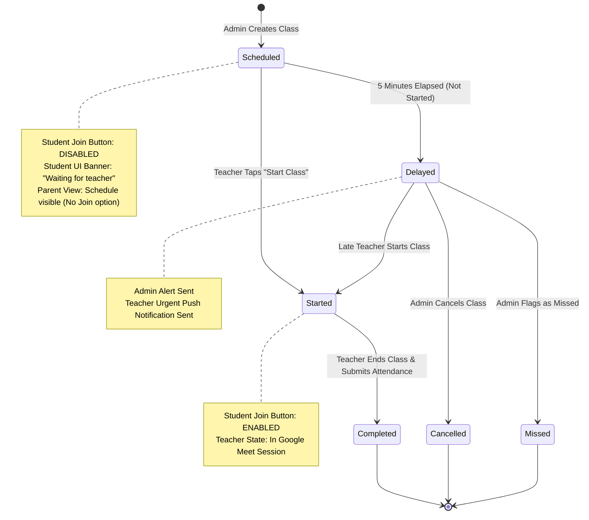

# Shalaverse — Product Specification & Requirements Document (PRD)

> **Complete Master Specification for Class Scheduling, Online Learning, Attendance, and Parent Engagement**  
> *Target System*: Cross-platform Educational Management Platform (Flutter / Dart)  
> *Document Version*: 1.0.0  

---

## 1. Vision & Executive Overview

**Shalaverse** is a cross-platform digital management application designed for educational institutions, including K-12 schools, coaching centres, tuition centres, and training academies. 

By unifying **Administrators**, **Teachers**, **Students**, and **Parents** into a single structured, real-time workspace, Shalaverse eliminates fragmentation across class scheduling, virtual classroom delivery via Google Meet, automated attendance tracking, delay alerting, and contextual communication. The platform empowers institutions to deliver high-quality, punctual, transparent, and accountability-driven education.

---

## 2. Goals

### 2.1 Business & Strategic Goals
* **Unified Educational Operations**: Replace disparate scheduling apps, messaging groups, and video-link lists with a centralized, single-source-of-truth solution.
* **Operational Efficiency**: Reduce admin overhead in scheduling, teacher allocation, and attendance reconciliation by over 60%.
* **Parent Retention & Trust**: Build parent confidence through real-time attendance verification, schedule transparency, and structured feedback resolution channels.

### 2.2 Product & Experience Goals
* **Zero-Friction Virtual Learning**: Integrate Google Meet seamlessly into class cards with strict state-bound join permissions.
* **Punctuality & Delay Prevention**: Enforce automated 15-minute reminders and 5-minute non-start delay alerts to keep classes running on time.
* **Role-Tailored Interfaces**: Deliver tailored views and strict RBAC boundaries so each stakeholder sees only relevant context without clutter or security risks.

---

## 3. Personas

| Persona | Role & Context | Key Needs & Pain Points | Core Goals |
| :--- | :--- | :--- | :--- |
| **Principal Priya** | **Administrator** Manages institute operations, timetables, and overall compliance. | Pain: Fragmented WhatsApp groups, untracked class delays, delayed attendance records. Need: Centralized scheduling, instant alerts for non-started classes, structured parent feedback. | Easily onboard staff/students, schedule classes, monitor delays, resolve parent queries efficiently. |
| **Teacher Tanvi** | **Teacher** Teaches multiple subjects across batches; delivers online sessions. | Pain: Manual attendance entry, sharing raw Meet links, managing parent queries directly during class. Need: Single dashboard for daily schedule, one-tap class starting, quick post-class attendance entry. | Start classes effortlessly, mark attendance (`Present`/`Absent`/`Late`/`Excused`), focus on teaching. |
| **Student Sam** | **Student** Attends online classes and tracks personal subject timetables. | Pain: Confusion around start times, invalid or old video links, missing class reminders. Need: Simple schedule view, clear notification when teacher starts class, single-click join button. | Know exactly when classes start, join Google Meet with zero link-copying, view attendance records. |
| **Parent Parag** | **Parent** Wants visibility into children’s education and attendance. | Pain: Lack of visibility into whether child attended class, no official channel to report issues. Need: Real-time schedule monitoring, verified attendance feeds, formal query submission. | Track child's attendance and class schedule; submit feedback linked directly to specific classes. |

---

## 4. Role-Based Access Control (RBAC) & Application Views Matrix

### 4.1 RBAC Matrix

| Role | Core Capabilities |
| :--- | :--- |
| **Administrator** | Manage user accounts (teachers, students, parents); create subjects & class schedules; assign teachers and students; view attendance & delay reports; review parent remarks and general queries. |
| **Teacher** | View assigned schedules and student rosters; initiate & join online class sessions; confirm post-class student attendance (`Present`, `Absent`, `Late`, `Excused`). |
| **Student** | View upcoming class schedule & subject details; join Google Meet session **only after the teacher starts the class**; view personal attendance history. |
| **Parent** | View linked children’s schedules, assigned teachers, and verified attendance; submit class-related remarks and general queries. **Strictly restricted from joining online classes.** |

### 4.2 Application Views Matrix

| Role | Primary Navigation Views |
| :--- | :--- |
| **Administrator** | Dashboard, Teachers, Students, Parents, Subjects, Class Scheduling, Attendance Overview, Delayed Classes, Remarks, General Queries |
| **Teacher** | Today's Classes, Upcoming Schedule, Class Details & Roster, Start/Join Class, Attendance Confirmation, Previous Classes |
| **Student** | Today's Classes, Upcoming Schedule, Class Details, Join Class (State-bound), Attendance History |
| **Parent** | Children Dashboard, Child Schedule, Teacher & Subject Details, Attendance History, Class Remarks, General Queries, Account Settings |

---

## 5. User Onboarding & Account Management

### 5.1 Invitation & Verification Flow
* **Email Invitations**: Administrators send email invitations to teachers, students, and parents with designated system roles.
* **Account Activation**: Invited users verify their email address, establish credentials, and join with their assigned role.
* **Unified Identity**: Existing users invited to additional roles sign in with their existing account without creating a duplicate login or password.
* **Multi-Role Support**: A single user may hold multiple responsibilities (e.g., an Administrator who also teaches specific subjects).

### 5.2 Student & Parent Profile Management
* **Student Profile Fields**: Student Name, Admission Number, Class / Batch, Assigned Subjects, and Status (`Active`, `Inactive`).
* **Multi-Parent Association**: One or more parent accounts can be linked to a single student profile.
* **Young Students (No Independent Login)**: Students without a mobile number or email address do not require an independent account. All schedules and attendance remain accessible via the linked parent account.
* **Older Students**: Invited to create independent logins for direct class participation.
* **Account Deletion Semantics**:
  * Parents can request account deletion via application settings.
  * Deleting a parent account removes the parent's login access and child linkage, but **preserves student academic, schedule, and attendance records**.

---

## 6. Subjects, Classes & Scheduling Engine

### 6.1 Subject & Class Configuration
* **Subjects**: Administrators configure course subjects (e.g., Mathematics, History, Science, English, or custom courses).
* **Schedule Attributes**: Subject, Assigned Teacher, Batch or Student List, Date, Start Time, and Duration.
* **Google Meet Association**: Every online class schedule automatically links to a designated Google Meet session.

### 6.2 Class Reminder Notifications
* **Timing**: Triggered exactly **15 minutes before** the scheduled start time (`class.scheduledStartTime.difference(DateTime.now()).inMinutes == 15`).
* **Teacher**: Receives assigned subject and start time reminder.
* **Student**: Receives upcoming class notification.
* **Parent**: Receives alert that the child's class is about to begin.

---

## 7. Online Class Execution & State Machine

### 7.1 Class Lifecycle States
1. `SCHEDULED`: Class is created and visible on schedules.
2. `STARTED`: Teacher has initiated the session; Google Meet link is active for students.
3. `COMPLETED`: Class session finished; awaiting teacher attendance confirmation.
4. `MISSED`: Class was not started within the grace period and flagged by Admin.
5. `CANCELLED`: Class officially closed or rescheduled by Admin.

### 7.2 Role-Based Virtual Class Journeys & Guardrails

#### Teacher Journey
1. Open scheduled class card.
2. Review subject, time, and assigned student roster.
3. Tap **Start Class** / **Join Class**.
4. System updates class status to `STARTED`, logs automated teacher attendance, and opens Google Meet session.
5. Student **Join** buttons become active globally.

#### Student Journey
1. Open scheduled class card.
2. Prior to teacher start (`classStatus == ClassStatus.scheduled`): **Join button remains disabled (`enabled = false`)**, displaying a *"Waiting for teacher to start class"* UI banner.
3. Once teacher starts class (`classStatus == ClassStatus.started`): **Join button activates**.
4. Tap **Join** to open Google Meet session.

#### Parent Guardrail Restrictions
* Parents can view schedules and teacher details but **MUST NEVER be presented with a "Join Class" or "Start Class" button**.
* Navigation to Google Meet session routes MUST be blocked by GoRouter redirect guards.

---

## 8. Delay Alerts & Missed Class Handling

* **5-Minute Non-Start Rule**: If a scheduled class is not started by the teacher within **5 minutes** after the start time (`DateTime.now().isAfter(class.scheduledStartTime.add(const Duration(minutes: 5)))` and `class.status == ClassStatus.scheduled`):
  1. Teacher receives an urgent start reminder push notification.
  2. Administrator receives an alert notifying them of the delayed start.
* **No Auto-Cancellation**: The system does **not** automatically cancel the class.
* **Admin Resolution Options**: The Administrator reviews delayed classes and decides whether to:
  * Keep the class open (awaiting late start)
  * Close / Cancel the class
  * Reschedule to another time
  * Flag the class as `MISSED`

---

## 9. Attendance Management Engine

### 9.1 Teacher Attendance
* **Automated Log**: Teacher attendance is automatically logged when the teacher taps **Start Class** in the application.

### 9.2 Student Attendance
* **Post-Class Confirmation**: Upon session completion, the teacher confirms attendance for each assigned student.
* **Attendance Options**:
  * `PRESENT`
  * `ABSENT`
  * `LATE`
  * `EXCUSED`
* **Data Context**: Attendance records bind to Student ID, Teacher ID, Subject ID, Class Date, and Scheduled Time.
* **Parent Visibility**: Attendance records become immediately visible to linked parents once confirmed by the teacher.

---

## 10. Parent Remarks & Query System (Ticketing)

Structured channels for parent communication with clear lifecycle tracking:

| Remark Type | Description & Workflow |
| :--- | :--- |
| **Class-Related Remark** | Submitted after a completed class. Automatically linked to Student, Parent, Teacher, Subject, Date, and Scheduled Class Time. |
| **General Query** | Submitted for fee inquiries, holiday schedules, admissions, or account support. Unlinked from specific classes or teachers. |

### Handling Statuses
All remarks and queries follow a strict status pipeline:
$$\text{NEW} \longrightarrow \text{IN REVIEW} \longrightarrow \text{RESOLVED} \longrightarrow \text{CLOSED}$$

---

## 11. Non-Functional Requirements

### 11.1 Architecture & Technical Stack
* **Framework**: Flutter SDK (`^3.11.0`) with Dart 3.
* **Architecture Pattern**: Clean Architecture with Feature-First module organization (`lib/src/features/` or `lib/features/`).
* **State Management**: BLoC pattern (`package:flutter_bloc`) with immutable, value-equatable state classes (`package:equatable` / sealed classes).
* **Routing**: Declarative Routing using `package:go_router` with centralized route guards for RBAC enforcement.
* **Environment Flavors**: Native build configurations for `dev`, `uat`, `stage`, and `prod` managed via `AppConfig`.

### 11.2 Security & Data Privacy
* **Role Isolation**: Server-side and client-side authorization ensuring users access only authorized endpoints and routes.
* **Class Scoping for Teachers**: Teachers view only classes and students assigned to them.
* **Child Scoping for Parents**: Parents view only children linked to their account.
* **Session Integrity**: Video room endpoints protected and accessible only via active authenticated app sessions.

### 11.3 Performance & Reliability
* **Launch Time**: Cold app startup under 2.0 seconds on mid-tier mobile devices.
* **Real-Time State Sync**: Schedule state transitions (`scheduled` $\rightarrow$ `started`) propagate to active student clients within $< 1.5$ seconds.
* **Offline Resilience**: Offline caching of schedules and historical attendance; gracefully queued actions during intermittent connectivity.

### 11.4 Quality Assurance & Static Analysis
* **Static Analysis**: Zero warnings under `flutter analyze` and standard `dart format`.
* **Testing Coverage**: Mandatory BLoC unit test suites (`bloc_test`) for state transitions and `WidgetTester` tests for role-restricted UI elements.

---

## 12. Success Metrics

| Metric Category | Key Performance Indicator (KPI) | Target Benchmark |
| :--- | :--- | :--- |
| **Operational Punctuality** | % of classes started within 5 minutes of scheduled time | $\ge 95\%$ |
| **Attendance Completeness** | % of completed classes with teacher-confirmed student attendance within 1 hour | $\ge 98\%$ |
| **Parent Engagement** | Weekly Active Parents (WAP) checking child schedules/attendance | $\ge 85\%$ |
| **Query Resolution Speed** | Average turnaround time for resolving parent remarks/queries | $< 24$ hours |
| **System Reliability** | Platform uptime during core operational hours (07:00 – 21:00) | $\ge 99.9\%$ |

---

## 13. Risks & Mitigations

| Risk Factor | Impact | Mitigation Strategy |
| :--- | :--- | :--- |
| **Teacher Delays / Forgetfulness** | High | Automated 15-minute reminders + 5-minute non-start delay escalation directly to institute Admins. |
| **Unauthorized Parent Access to Virtual Class** | Medium / Security | Strict GoRouter navigation guards and complete removal of video action buttons for Parent profiles. |
| **Third-Party Video Platform Disruption** | High | Encapsulated video service interface allowing fallback integration options if Google Meet APIs experience outages. |
| **Network Instability During Attendance Submission** | Medium | Local database queuing of attendance payloads with background auto-retry upon reconnection. |

---

## 14. Constraints

* **SDK Version Lock**: Flutter SDK `^3.11.0` and Dart 3 strict typing constraints.
* **Design & State Guardrails**: Strict adherence to BLoC state management and Clean Architecture directory structure.
* **Third-Party Service Limits**: Google Meet link generation and API quotas managed according to Workspace tier limits.
* **Zero Workarounds Policy**: No masking runtime issues with empty try-catch blocks or quiet default fallbacks.

---

## 15. End-to-End User Journeys

### 15.1 Class Execution State Flow

### 15.2 Step-by-Step User Journeys

#### A. Administrator Journey (Schedule & Monitor)
1. **Onboarding**: Logs into Admin Dashboard, creates Subjects (e.g., Mathematics), invites Teachers and Students via email.
2. **Scheduling**: Creates a class schedule assigned to Teacher Tanvi and Batch A for 10:00 AM. System provisions Google Meet link.
3. **Delay Escalation**: At 10:05 AM, if class status remains `scheduled`, Admin receives a "Class Non-Start" alert.
4. **Resolution**: Admin reviews live status, calls teacher or reschedules/flags class accordingly.

#### B. Teacher Journey (Deliver & Record)
1. **Notification**: Receives 15-minute push reminder at 09:45 AM for 10:00 AM Mathematics class.
2. **Launch**: Opens app at 09:58 AM, opens class card, taps **Start Class**.
3. **Session Execution**: Status changes to `started`, system logs teacher attendance, Google Meet opens.
4. **Wrap-up**: Taps **End Session**, fills student attendance modal (`Present`/`Absent`/`Late`/`Excused`), and submits.

#### C. Student Journey (Attend & Learn)
1. **Reminder & Check**: Receives reminder at 09:45 AM. Opens app at 09:55 AM.
2. **Waiting State**: Class card shows `scheduled`. Join button is **disabled** with *"Waiting for teacher to start class"* banner.
3. **Join Class**: At 10:00 AM, teacher starts class. UI updates immediately to `started` and Join button **activates**.
4. **Participation**: Student taps **Join Class** to launch Google Meet session.

#### D. Parent Journey (Track & Engage)
1. **Overview**: Opens parent view to check linked child’s schedule for the day.
2. **Restricted Join**: Views Mathematics class scheduled for 10:00 AM (no join button presented; route access blocked).
3. **Attendance Verification**: At 11:05 AM, receives notification that child attendance was marked `PRESENT`.
4. **Feedback**: Taps **Add Class Remark** to leave a contextual query for Teacher/Admin regarding homework. Ticket status set to `newTicket`.
